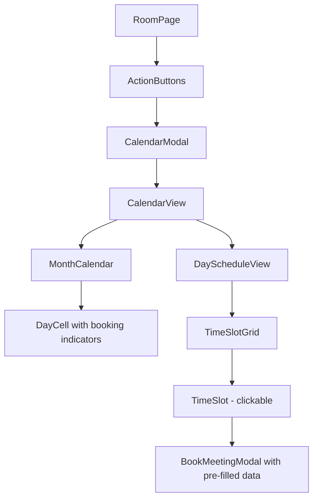
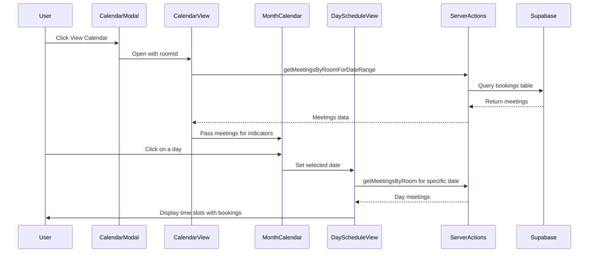
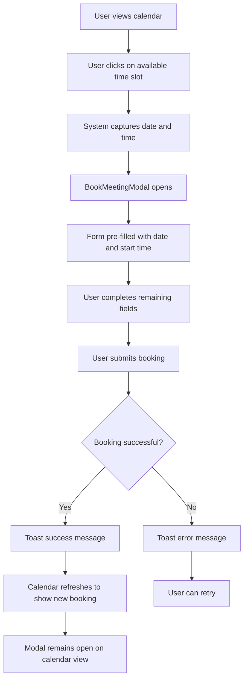

# View Calendar Feature - Implementation Plan

## Overview

This document outlines the implementation plan for the "View Calendar" feature (Story 7.1) in the Planet Education Networks Meeting Room Booking System. The feature will provide a combined calendar view with month navigation and day/week detail view, allowing users to visualize room availability and book meetings directly from the calendar.

---

## Requirements Summary

Based on user stories and gathered requirements:

- **Calendar Type**: Combined view with month calendar for navigation + day/week detail view
- **Interactivity**: Users can click on available time slots to open the booking form with pre-filled date/time
- **Scope**: Calendar shows bookings for a specific room
- **Navigation**: Month-based navigation with ability to view detailed day schedules
- **Responsive**: Works on mobile, tablet, and desktop

---

## Component Architecture



### New Components to Create

| Component                                                                                    | Location                                          | Purpose                                        |
| -------------------------------------------------------------------------------------------- | ------------------------------------------------- | ---------------------------------------------- |
| [`CalendarModal`](<app/(main)/rooms/[id]/components/calendar-modal.tsx>)                     | `app/(main)/rooms/[id]/components/`               | Modal wrapper for calendar view                |
| [`CalendarView`](<app/(main)/rooms/[id]/components/calendar-view/index.tsx>)                 | `app/(main)/rooms/[id]/components/calendar-view/` | Main calendar container with month + day views |
| [`MonthCalendar`](<app/(main)/rooms/[id]/components/calendar-view/month-calendar.tsx>)       | `app/(main)/rooms/[id]/components/calendar-view/` | Month grid with booking indicators             |
| [`DayScheduleView`](<app/(main)/rooms/[id]/components/calendar-view/day-schedule-view.tsx>)  | `app/(main)/rooms/[id]/components/calendar-view/` | Detailed day timeline with time slots          |
| [`TimeSlotGrid`](<app/(main)/rooms/[id]/components/calendar-view/time-slot-grid.tsx>)        | `app/(main)/rooms/[id]/components/calendar-view/` | Grid of clickable time slots                   |
| [`BookingIndicator`](<app/(main)/rooms/[id]/components/calendar-view/booking-indicator.tsx>) | `app/(main)/rooms/[id]/components/calendar-view/` | Visual indicator for booked slots              |

### Existing Components to Modify

| Component                                                                           | Modification                                         |
| ----------------------------------------------------------------------------------- | ---------------------------------------------------- |
| [`ActionButtons`](<app/(main)/rooms/[id]/components/action-buttons.tsx:44>)         | Wire up "View calendar" button to open CalendarModal |
| [`BookMeetingForm`](<app/(main)/rooms/[id]/components/book-meeting-form/index.tsx>) | Accept optional pre-filled date and startTime props  |

---

## Data Fetching Strategy

### New Server Action Required

Create a new action to fetch meetings for a date range:

```typescript
// actions/meeting.ts - New function
export const getMeetingsByRoomForDateRange = async (
  roomId: string,
  startDate: string,
  endDate: string
) => {
  // Fetch all meetings for a room within a date range
  // Used for month view to show booking indicators
};
```

### Data Flow



### Caching Strategy

- Use React state to cache the current month's meetings
- Refetch when navigating to a new month
- Use existing [`getMeetingsByRoom`](actions/meeting.ts:9) for day detail view

---

## UI/UX Design

### Layout Structure

```
┌─────────────────────────────────────────────────────────────┐
│  Calendar View - Room Name                              [X] │
├─────────────────────────────────────────────────────────────┤
│                                                             │
│  ┌─────────────────────────────────────────────────────┐   │
│  │  < January 2026 >                                    │   │
│  │  ┌───┬───┬───┬───┬───┬───┬───┐                      │   │
│  │  │Sun│Mon│Tue│Wed│Thu│Fri│Sat│                      │   │
│  │  ├───┼───┼───┼───┼───┼───┼───┤                      │   │
│  │  │   │   │   │ 1 │ 2 │ 3 │ 4 │                      │   │
│  │  │   │   │   │ ● │   │ ● │   │  ● = has bookings    │   │
│  │  ├───┼───┼───┼───┼───┼───┼───┤                      │   │
│  │  │ 5 │ 6 │ 7 │ 8 │ 9 │10 │11 │                      │   │
│  │  │   │ ● │   │   │ ● │ ● │   │                      │   │
│  │  └───┴───┴───┴───┴───┴───┴───┘                      │   │
│  └─────────────────────────────────────────────────────┘   │
│                                                             │
│  ┌─────────────────────────────────────────────────────┐   │
│  │  Thursday, January 15, 2026                          │   │
│  │  ─────────────────────────────────────────────────── │   │
│  │  09:00  ░░░░░░░░░░░░░░░░░░░░░░░░░░░░░░░░░░░░░░░░░░  │   │
│  │  09:30  ████████████████████ Team Standup            │   │
│  │  10:00  ████████████████████ Team Standup            │   │
│  │  10:30  ░░░░░░░░░░░░░░░░░░░░░░░░░░░░░░░░░░░░░░░░░░  │   │
│  │  11:00  ░░░░░░░░░░░░░░░░░░░░░░░░░░░░░░░░░░░░░░░░░░  │   │
│  │  11:30  ████████████████████ Client Call             │   │
│  │  12:00  ████████████████████ Client Call             │   │
│  │  ...                                                 │   │
│  └─────────────────────────────────────────────────────┘   │
│                                                             │
└─────────────────────────────────────────────────────────────┘

░░░ = Available slot (clickable)
███ = Booked slot (shows meeting info)
```

### Responsive Behavior

| Breakpoint              | Layout                                       |
| ----------------------- | -------------------------------------------- |
| Mobile (< 768px)        | Drawer from bottom, stacked month + day view |
| Tablet (768px - 1024px) | Modal, stacked month + day view              |
| Desktop (> 1024px)      | Large modal, side-by-side month + day view   |

### Color Coding

- **Available slots**: Background color with hover effect
- **Booked slots**: Primary color with meeting title
- **Past slots**: Muted/disabled appearance
- **Today**: Accent highlight on month calendar
- **Selected day**: Primary ring/border

---

## Interactive Booking Flow



### Pre-fill Logic

When user clicks an available time slot:

1. Close the calendar modal (or keep it open based on UX preference)
2. Open BookMeetingModal with:
   - `date`: Selected date from calendar
   - `startTime`: Clicked time slot (e.g., "09:00")
3. User fills in remaining required fields:
   - Name
   - Email (username + domain)
   - Duration (defaults to 15 minutes)
   - Optional guests

---

## State Management

### CalendarView State

```typescript
interface CalendarViewState {
  currentMonth: Date; // Currently displayed month
  selectedDate: Date | null; // Selected day for detail view
  monthMeetings: Meeting[]; // All meetings for current month
  dayMeetings: Meeting[]; // Meetings for selected day
  isLoadingMonth: boolean; // Loading state for month data
  isLoadingDay: boolean; // Loading state for day data
  bookingSlot: {
    // Pre-fill data for booking
    date: Date;
    startTime: string;
  } | null;
}
```

### Event Handlers

| Event            | Handler                | Action                                  |
| ---------------- | ---------------------- | --------------------------------------- |
| Month navigation | `handleMonthChange`    | Fetch new month's meetings              |
| Day selection    | `handleDaySelect`      | Update selectedDate, fetch day meetings |
| Time slot click  | `handleSlotClick`      | Set bookingSlot, open booking modal     |
| Booking success  | `handleBookingSuccess` | Refresh calendar data                   |

---

## Implementation Checklist

### Phase 1: Foundation

- [ ] Create [`CalendarModal`](<app/(main)/rooms/[id]/components/calendar-modal.tsx>) component
- [ ] Create [`CalendarView`](<app/(main)/rooms/[id]/components/calendar-view/index.tsx>) container component
- [ ] Add [`getMeetingsByRoomForDateRange`](actions/meeting.ts) server action
- [ ] Wire up "View calendar" button in [`ActionButtons`](<app/(main)/rooms/[id]/components/action-buttons.tsx>)

### Phase 2: Month Calendar

- [ ] Create [`MonthCalendar`](<app/(main)/rooms/[id]/components/calendar-view/month-calendar.tsx>) component
- [ ] Implement month navigation (previous/next)
- [ ] Add booking indicators on days with meetings
- [ ] Highlight today and selected date
- [ ] Disable past dates (optional: show but not clickable)

### Phase 3: Day Schedule View

- [ ] Create [`DayScheduleView`](<app/(main)/rooms/[id]/components/calendar-view/day-schedule-view.tsx>) component
- [ ] Create [`TimeSlotGrid`](<app/(main)/rooms/[id]/components/calendar-view/time-slot-grid.tsx>) component
- [ ] Display time slots from 9:00 AM to 9:30 PM (matching [`TIME_SLOTS`](lib/constants.ts:23))
- [ ] Show booked meetings as blocks with title/booker info
- [ ] Make available slots clickable
- [ ] Filter out past time slots for today

### Phase 4: Interactive Booking

- [ ] Modify [`BookMeetingForm`](<app/(main)/rooms/[id]/components/book-meeting-form/index.tsx>) to accept pre-filled props
- [ ] Implement slot click → booking modal flow
- [ ] Handle booking success → calendar refresh
- [ ] Add loading states during data fetching

### Phase 5: Responsive Design

- [ ] Implement drawer pattern for mobile
- [ ] Test and adjust layouts for all breakpoints
- [ ] Ensure touch-friendly interactions on mobile
- [ ] Add proper scroll behavior for day schedule

### Phase 6: Polish & Accessibility

- [ ] Add keyboard navigation for calendar
- [ ] Implement proper ARIA labels
- [ ] Add loading skeletons
- [ ] Add empty state for days with no bookings
- [ ] Test with screen readers
- [ ] Add animations/transitions

---

## Technical Considerations

### Dependencies

The project already has the necessary dependencies:

- [`react-day-picker`](package.json:30) - For month calendar (already used in date picker)
- [`date-fns`](package.json:25) - For date manipulation
- [`vaul`](package.json:35) - For drawer on mobile
- [`@radix-ui/react-dialog`](package.json:13) - For modal on desktop

### Performance

- Lazy load calendar modal content
- Memoize expensive calculations (available slots)
- Use `useMemo` for filtered/processed meeting data
- Consider virtualization for long time slot lists (if needed)

### Database Query Optimization

The new `getMeetingsByRoomForDateRange` query should:

- Use indexed columns (`room_id`, `start_time`)
- Limit date range to prevent large result sets
- Consider pagination for rooms with many bookings

---

## File Structure After Implementation

```
app/(main)/rooms/[id]/
├── components/
│   ├── action-buttons.tsx          # Modified
│   ├── book-meeting-modal.tsx
│   ├── book-meeting-form/
│   │   ├── form-schema.ts
│   │   └── index.tsx               # Modified to accept pre-fill props
│   ├── quick-meeting-modal.tsx
│   ├── quick-meeting-form/
│   │   ├── form-schema.ts
│   │   └── index.tsx
│   ├── calendar-modal.tsx          # NEW
│   └── calendar-view/              # NEW directory
│       ├── index.tsx               # Main CalendarView component
│       ├── month-calendar.tsx      # Month grid with indicators
│       ├── day-schedule-view.tsx   # Day timeline
│       ├── time-slot-grid.tsx      # Clickable time slots
│       ├── booking-indicator.tsx   # Visual booking marker
│       └── types.ts                # TypeScript interfaces
├── loading.tsx
└── page.tsx

actions/
├── building.ts
├── domain.ts
├── meeting.ts                      # Modified - add getMeetingsByRoomForDateRange
└── room.ts
```

---

## Success Criteria

1. ✅ Users can open calendar view from room detail page
2. ✅ Month calendar displays with booking indicators
3. ✅ Users can navigate between months
4. ✅ Clicking a day shows detailed schedule
5. ✅ Available time slots are clearly visible
6. ✅ Clicking available slot opens booking form with pre-filled data
7. ✅ Booking from calendar updates the view
8. ✅ Works responsively on all device sizes
9. ✅ Accessible via keyboard and screen readers
10. ✅ Consistent with existing design system

---

## Questions for Stakeholders

1. Should the calendar show bookings across all rooms in a building, or just the selected room?

   - **Current assumption**: Single room only

2. Should users be able to see who booked meetings in the calendar view?

   - **Current assumption**: Yes, show booker name on hover/in detail

3. What should happen after a successful booking from calendar?

   - **Current assumption**: Stay on calendar, refresh data

4. Should there be a week view option in addition to day view?
   - **Current assumption**: Day view only for MVP, week view as future enhancement

---

_Document created: January 15, 2026_
_Last updated: January 15, 2026_
